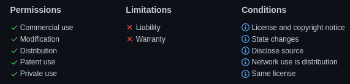

class: center, middle

<!--  -->

# Brief technical overview of the Constructicon implementation

## Radovan Bast [@\_\_radovan](https://twitter.com/__radovan)

### UiT The Arctic University of Norway

### Text is CC-BY

---

## Separation of web app and data

- Data is hosted at https://github.com/constructicon/russian-data
- Web app source code is at https://github.com/constructicon/russian
- Web app is hosted as static page on [GitHub Pages](https://pages.github.com/)
- The user interface is managed by your browser
- .emph[Privacy]: all user interaction stays on your browser, no data is sent "back"


### Technologies used

- https://www.getzola.org/ (static site)
- https://vuejs.org/ (front-end user interface)
- https://vue-treeselect.js.org/ (for tree-select in advanced search)
- https://github.com/bvaughn/js-search (for searching)
- https://getbootstrap.com/ (CSS)
- https://github.com/nodeca/js-yaml (parsing YAML files)
- https://github.com/axios/axios (fetching the data)
- https://lodash.com/ (debouncing)

---

## Data storage and format

- We wanted .emph[lightweight maintenance]
- The "database" is a GitHub repository: https://github.com/constructicon/russian-data
- We have chosen the [YAML format](https://en.wikipedia.org/wiki/YAML) because we wanted a .emph[hierarchical] data structure
- Readable/writable by .emph[both humans and programs]
- .emph[Standard] data format

---

[Example (truncated)](https://github.com/constructicon/russian-data/blob/main/data/0003.yml)
```yaml
---
record: 3
name: '(а) как же NP-Nom?'
UD_name: '(а) как же NP-Nom?'
illustration: 'А как же мама?'
cefr_level: A1
definitions:
  - russian: |
       Конструкция используется для того, чтобы напомнить адресату о [каком-либо факте]Theme, который он должен принять во внимание. Этот факт известен всем участникам беседы.
  - english: |
       This construction is used to remind the addressee of [some fact]Theme, which they must take into consideration. This fact is known to all of the participants in the conversation.
  - norwegian: |
       Konstruksjonen anvendes for å minne adressaten på [et faktum]Theme som vedkommende må ta i betraktning. Faktumet er kjent for alle deltakerne i samtalen.
examples:
  - |
       Иван поднял голову и спросил: ― А как же [я]Theme? ― Ты будешь жить с женой и воспитывать сына, ― ответила Ирина.
  - |
       ― Всё, ― объявил водитель, ― дальше не поеду. ― Как же [деньги]Theme? Я заплатил за билет!
  - |
       В нашем городе ему предложили хорошую работу, поэтому он недолго думая сорвался с насиженного места и уехал. ― А как же  [жена и дети]Theme? ― поинтересовалась Маша.
  - |
       Но как только разговор заходит о семейном обучении, первым делом звучит: «А как же [общение]Theme? [Социализация]Theme?»
  - |
       В деревне делали более лёгкую пиццу: тесто поливали оливковым маслом, выкладывали маслины или вообще ничем не украшали. А как же [томаты]Theme, спросите вы. Ведь без них попросту невозможно представить себе пиццу.
morphology:
  - NP
  - Nom
```

---

## How to suggest improvements

- For new constructions: https://constructicon.github.io/russian/about/
- Fixing typos/mistakes: https://github.com/constructicon/russian-data
- Web app: https://github.com/constructicon/russian/issues


## Supported browsers

- If a (modern) browser is unsupported, it is a bug,
  not a decision. Please submit a [bug report](https://github.com/constructicon/russian/issues) in this case.

---

## Open access and open source

The web app is licensed under the [GNU Affero General Public License v3.0](https://github.com/constructicon/russian/blob/main/LICENSE)


